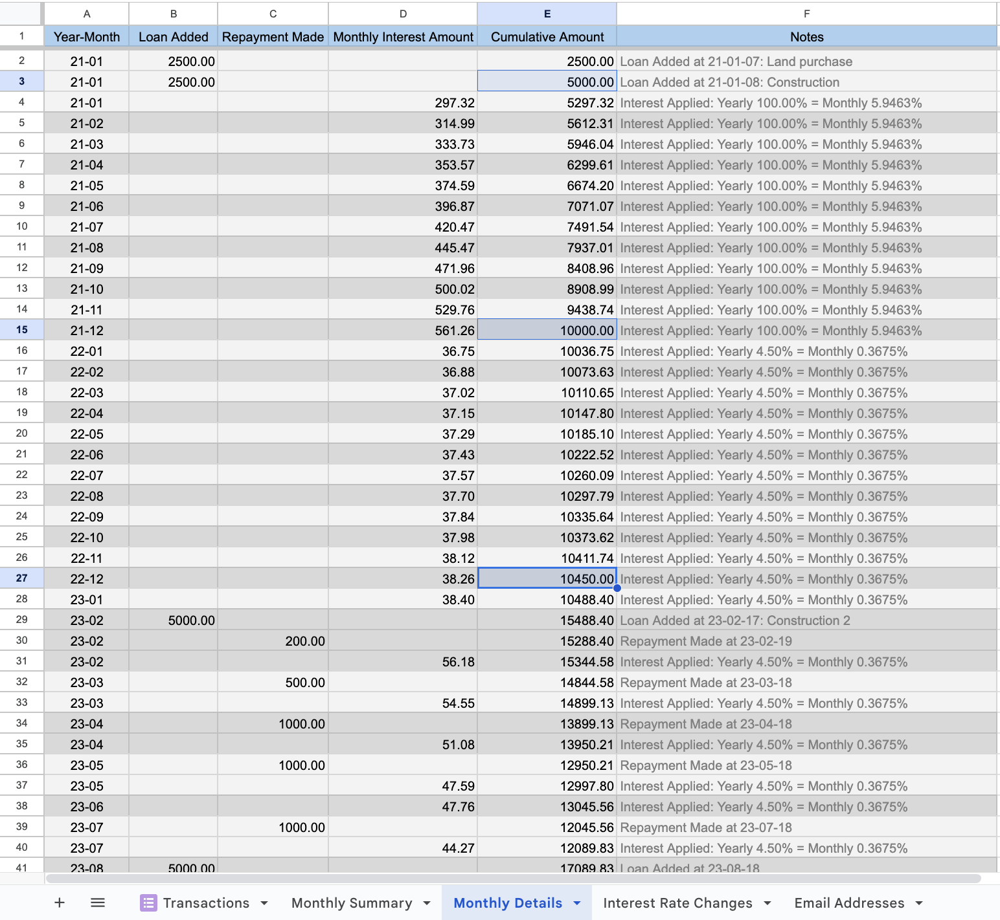

# Loan Management System: Google Sheets & Google App Script 🚀

## Introduction 🌟
Welcome to the future of Loan Management! Tired of manually tracking loans between friends, family, or business partners? Say hello to automation! 🌈 Our **Loan Management System** built on Google Sheets and Google App Script is your one-stop solution. This isn't just a spreadsheet; it's a **robust loan management tool**. From auto-calculating monthly interest to handling fluctuating yearly interest rates to even sending out email notifications, this system does it all! 💌

**What's Inside the Box:**
- 📊 **Monthly Summary and Details**: Get a comprehensive breakdown of loan balances, interest rates, and payments.
- 📧 **Automated Email Notifications**: Why check when you can get notified? Receive detailed loan summaries and updates directly in your inbox.
- ⏰ **Scheduled Triggers**: Set it and forget it! Automatic monthly updates and email notifications take the work out of your hands.
- 🌐 **Shared Access**: Keep everyone in the loop! Update and share your loan status easily with Google Sheets and Google Forms.

## Screenshots 📸

**Monthly Details**

In this screenshot, take note of the highlighted cells that indicate the "Remaining Loan Amount" over different periods. Initially, the loan amount is 5,000 and it doubles to 10,000 within one year, due to a yearly interest rate of 100%. When the interest rate is adjusted to 4.5%, the remaining amount grows from 10,000 to 10,450 over the span of another year. This serves as proof of the system's accurate and dynamic interest calculation capabilities.

## How to Get Started

### Step 1: Duplicate the Files 📋

#### Google Spreadsheet
- **Step 1.1**: Click on this [Google Spreadsheet link](https://docs.google.com/spreadsheets/d/1AwblgsKNqhV6n6_jwJASYAMdXEvDkXwcBfXqgTKxBKc).
- **Step 1.2**: Go to `File` -> `Make a copy`.

#### Google Form
- **Step 1.3**: Click on this [Google Form link](https://docs.google.com/forms/d/1e0y4KoUm4ixYAx-mn5XKrfzxkleW7CxeRMIDdScKkzc).
- **Step 1.4**:  Use the `...` (More) menu in the upper-right corner and select `Make a copy` to create a copy of the form in your Google Drive.

**Note**: After you've duplicated both the Google Form and Spreadsheet, you'll need to link them together. It's simple! Just head over to your Google Form, click on the 'Responses' tab, and then hit the Google Sheets icon. Make sure to select the copied spreadsheet from your Drive. And guess what? The first time you open your new Google Spreadsheet, it initializes an empty 'Transactions' sheet that's directly linked to the Form. Now that's what we call seamless automation! 🎉

After duplicating the Google Form and Spreadsheet, you'll need to manually link them. Simply go to the Google Form, click on the "Responses" tab, and then click on the Google Sheets icon to select your duplicated spreadsheet. Here's the magic part: The first time you open your new spreadsheet, it automatically runs an initialization script. This script takes care of emptying "Transactions" sheet, and emptying the monthly summary and details. Just by opening the spreadsheet, you're all set and ready to go—how awesome is that? 🚀

### Step 2: Setup Email Addresses 📧

#### Spreadsheet Structure
After duplicating the shared Google Spreadsheet, you'll find it has the following sheets:

- **Monthly Summary**: For summarizing the loan details.
- **Monthly Details**: For capturing detailed transactions.
- **Email Addresses**: For storing email addresses and other email-related information.
- **Interest Rate Changes**: Tracks any changes in the yearly interest rate. More on this below.

The 'Email Addresses' sheet should have the following structure:

| Lender Email | Borrower Email | Email Subject | Thread ID |
|--------------|----------------|---------------|-----------|
| lender@xyz.com | borrower@xyz.com | Monthly Loan Summary | |

- **Lender Email**: The email address of the lender.
- **Borrower Email**: The email address of the borrower.
- **Email Subject**: The subject line for the email notification. This is optional and a default subject will be used if left blank.
- **Thread ID**: This field is used by the script to keep track of the email thread and should be left empty initially.

The 'Interest Rate Changes' sheet should have the following structure:

| Date of Change | Updated Yearly Interest Rate |
|----------------|-----------------------------|
| 2021-01-01     | 5.5                         |
| 2022-01-01     | 4.5                         |

- **Date of Change**: The date when the yearly interest rate was changed.
- **Updated Yearly Interest Rate**: The updated yearly interest rate in percentage.

### Step 3: Use the Custom Menu in Google Spreadsheet 🛠

In the Google Spreadsheet, you'll find a custom menu at the top named **"Custom Menu: Run Monthly Update / Send Email / Setup Trigger."** This menu provides you with three powerful options:

1. **Update Monthly Summary and Monthly Details**: Manually refreshes the Monthly Summary and Monthly Details sheets with up-to-date data.
2. **Send Email**: Manually triggers the sending of the Monthly Summary email.
3. **Setup Trigger**: Automates the system to update content and send emails every 1st of the month at 10 a.m.. This function just needs to be run once to set up the trigger. However, it's implemented robustly, so don't worry if you accidentally run it more than once.

### Step 4: Fill in the Google Form 📝

Once everything is set up, all you need to do is fill in the Google Form to add new loan transactions or repayments. The system will automatically update the Monthly Summary and Details, and you'll receive email notifications as per your setup. It's that simple!

## Collaborations 🤝

This project is developed in collaboration with GPT-4 by OpenAI.
